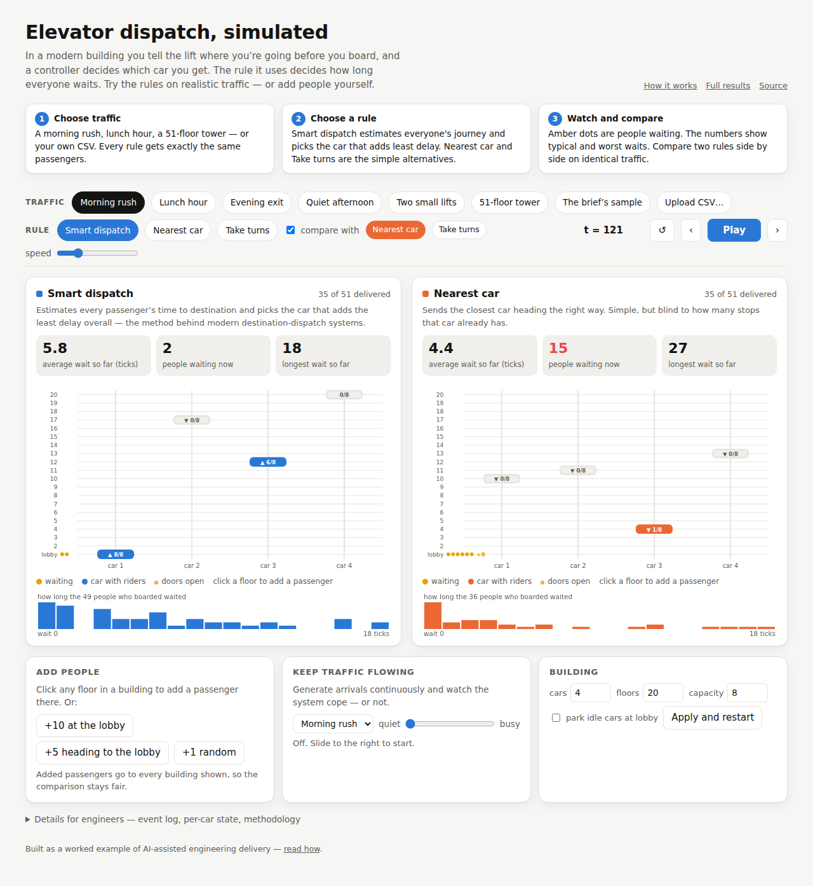

# elevator-dispatch-sim

[](https://github.com/samuelgregorovic/elevator-dispatch-sim/actions/workflows/ci.yml)

Discrete-time simulation of a destination-dispatch elevator system, built against the brief in [`docs/brief.pdf`](docs/brief.pdf): configurable cars, floors and capacity; three scheduling algorithms behind one interface; the positions log and passenger statistics the brief asks for; and a measured comparison of the schedulers on realistic traffic patterns.

**See it run without installing anything:** [the interactive simulator](https://samuelgregorovic.github.io/elevator-dispatch-sim/docs/viewer/) runs the engine in your browser — pick a traffic pattern and any building (cars, floors, capacity, number of people), watch all three rules side by side on identical traffic with a live ranking, click a floor to add a passenger, turn on continuous arrivals, or upload your own CSV. It is a JavaScript port of the Python engine, verified identical on every committed scenario by an automated test.


[](https://samuelgregorovic.github.io/elevator-dispatch-sim/docs/viewer/)


## Looking at the solution on GitHub, without running anything

- **[The interactive simulator](https://samuelgregorovic.github.io/elevator-dispatch-sim/docs/viewer/)** — the engine running in the browser (GitHub Pages, static, no install): traffic patterns for any building, all three rules side by side with a live ranking, add passengers, live traffic, your own CSV. Space to play, ← → to step.
- **[The presentation](docs/presentation/elevator-dispatch.pdf)** — a sixteen-slide walkthrough with speaker notes ([PowerPoint](docs/presentation/elevator-dispatch.pptx)): the question, the model, the rules, the evidence, which rule for which building, and how the work was done.
- **[The whitepaper](docs/WHITEPAPER.md)** — the whole story top to bottom for a mixed audience: the question, the model, the rules, the evidence, and which rule and policy to choose for which building and traffic.
- **[Comparison table](docs/results/comparison.md)** — average, p90 and maximum wait and total time for every scheduler on every scenario; discussed in [`docs/DESIGN.md`](docs/DESIGN.md#what-the-comparison-shows).
- **[Charts](docs/charts/)** — wait by scenario, wait distributions, positions over time, fairness sweeps, car usage and balance.
- **[An example run](docs/example_run/)** — the exact files `run` produces for the morning up-peak: [`positions.csv`](docs/example_run/positions.csv) (one row per tick), [`summary.json`](docs/example_run/summary.json) and the printed [`summary.txt`](docs/example_run/summary.txt).
- **[Source](src/elevator_sim/)** — start at [`simulation.py`](src/elevator_sim/simulation.py) for the tick loop, [`model.py`](src/elevator_sim/model.py) for car behaviour, [`schedulers/etd.py`](src/elevator_sim/schedulers/etd.py) for the cost function; [`tests/`](tests/) for what is guaranteed.

## How to run

Requires Python 3.11+. The simulation itself has no third-party dependencies.

```bash
git clone https://github.com/samuelgregorovic/elevator-dispatch-sim.git
cd elevator-dispatch-sim

# with uv (recommended: also installs the dev tools)
uv sync --group dev
uv run python -m elevator_sim run scenarios/sample.csv --elevators 2 --floors 51 --capacity 8

# or with plain Python, no install
PYTHONPATH=src python3 -m elevator_sim run scenarios/sample.csv --elevators 2
```

`run` writes `positions.csv` (one row per tick, one column per elevator), `trace.json` (per-tick car state and every request/assign/board/alight event) and `summary.json` into `outputs/run/` (change with `--out`), and prints the passenger statistics:

```
scheduler: etd
passengers: 3   ticks simulated: 77

           min   max    mean    p50    p90
wait         0    45   15.00      0     45
travel      20    51   36.00     37     51
total       37    65   51.00     51     65

observations:
  - median wait is 0 ticks: most passengers boarded immediately
  - 2 passengers boarded in the tick they requested (wait 0)
  - busiest origin floor: 1 (2 of 3 requests)
  - direction mix: 2 up, 1 down
  - elevator 1: carried 1, stops 2, floors travelled 50, idle 34% of ticks
  - elevator 2: carried 2, stops 4, floors travelled 72, idle 3% of ticks
```

Options for `run`: `--scheduler {etd,nearest_car,round_robin}` (default `etd`), `--fairness W` (ETD age weight, default 0), `--dwell N` (ticks per stop, default 1; `0` is the literal brief), `--start-floor`, `--park-floor` (send idle cars there), `--express CAR:FLOORS` (e.g. `--express 3:1,30-51` makes car 3 serve only the lobby and floors 30–51).

Other commands:

```bash
uv run python -m elevator_sim compare                    # every scheduler × every scenario, table + JSON
uv run python -m elevator_sim compare --fairness 0.5 --out docs/results          # regenerate the committed tables
uv run python scenarios/generate.py                      # regenerate the scenario CSVs (seeded, byte-identical)
uv sync --group dev --extra viz && uv run python -m elevator_sim report --fairness 0.05 --fairness 0.2 --fairness 0.5 --fairness 1   # PNG charts as committed
uv run pytest                                            # 131 tests (40 are the JS/Python conformance matrix; need Node)
uv run ruff check . && uv run ruff format --check .
```

## What was built

| | |
|---|---|
| **Engine** | Tick loop with a fixed order of operations; LOOK car movement; capacity; configurable dwell per stop; a request feed that structurally cannot peek ahead; input validation that fails fast with the row named. |
| **Schedulers** | `etd` — estimated-time-to-destination cost-based assignment as used by commercial destination-dispatch controllers, with an optional fairness weight; `nearest_car` and `round_robin` as baselines. |
| **Scenarios** | Seeded generator for morning up-peak, lunchtime two-way, evening down-peak and interfloor traffic with the office mixes from the elevator-traffic literature, plus a capacity burst and two 51-floor cases chosen as stress tests; policy variants for parking at the lobby and zoned express cars. |
| **Outputs** | Positions log, JSON trace, statistics with p50/p90 and generated observations, a comparison table, PNG charts, and an interactive browser simulator on GitHub Pages (JavaScript port of the engine, conformance-tested against Python). |
| **Tests** | 131 tests: unit tests for every observable assumption, a structural no-peek-ahead test, property-based invariants over random buildings, golden statistics, end-to-end CLI checks, and a JavaScript/Python conformance matrix — plus adversarial testing: a 400-seed fuzz and malformed inputs. |

## Results in brief

Full table and discussion in [`docs/DESIGN.md`](docs/DESIGN.md); raw numbers in [`docs/results/comparison.md`](docs/results/comparison.md); which rule and policy to choose for which building, with the reasoning, in [`docs/WHITEPAPER.md`](docs/WHITEPAPER.md#which-rule-which-policy-for-which-building).

- ETD has the lowest average and p90 wait on every realistic traffic pattern: 1.2× (quiet interfloor) to 3.7× (tall building) lower average wait than nearest-car, and 2–3.3× lower than round robin.
- Under a single-origin capacity burst ETD and round robin tie: when the system is saturated the only lever is spreading load evenly.
- ETD also uses the least car-time (cars busy 62% of the morning peak against 89% nearest-car and 95% round robin) but shares the work least evenly (one car in four carries 36% of the passengers); the fairness weight evens the cars as a side effect. Per-car usage is reported by every command and shown live in the simulator.
- Parking idle cars at the lobby cuts ETD's up-peak average wait by ~40%. A fairness weight of 0.5 halves the tall building's maximum wait at a ~25% cost in average wait, improves everything under the capacity burst, and is close to neutral on the 20-floor patterns — a per-building tuning knob, not a free improvement.
- Splitting six cars into local and express zones is worse than six free cars at moderate load: zoning trades flexibility for stop reduction and only pays off under saturation.


## Time and cost

About one hour of my own time framing the problem, writing the plan and reviewing the outputs, then autonomous execution of the plan by AI tooling, plus follow-up steering for later changes. AI usage cost less than €50 in total, across Fable 5.1 at medium effort for the planning, execution, fixes and documentation, with Opus 5 and Sonnet 5 on smaller follow-up tasks; the two design-tool runs (interface and deck) are included.

## Assumptions, simplifications and trade-offs

Every decision the brief left open — what costs time, the order of operations inside a tick, immutable assignment, direction discipline, floor numbering, idle behaviour, validation — is recorded with its reason in [`docs/ASSUMPTIONS.md`](docs/ASSUMPTIONS.md). Design-level trade-offs (tick-based over event-driven, exact projection over a heuristic ETA, greedy per-request assignment, immutable assignment) are discussed in [`docs/DESIGN.md`](docs/DESIGN.md). The testing approach is in [`docs/TESTING.md`](docs/TESTING.md).

## What I would improve with more time

1. **Reassignment window.** Allow the controller to move a passenger to another car until their car starts slowing for the pickup, as hybrid ETA systems do. This is the single change most likely to improve results under bursty load, and it needs a display model (what the passenger was told) to stay honest.
2. **Batch re-optimisation.** Re-evaluate all outstanding assignments every few ticks instead of deciding each request once; the greedy per-request choice is what loses on the brief's three-request sample.
3. **Time-of-day policies.** Parking floor and fairness weight should follow the traffic profile (park low in up-peak, high in down-peak) rather than being fixed per run.
4. **Richer physics.** Door times and acceleration would make dwell a function of stop type; the one-tick model is enough to make stops cost something, which is all the comparison needs.
5. **Sky-lobby transfers.** Two-leg journeys across zones, so that zoned buildings can serve interfloor traffic; a routing problem across banks rather than a scheduler change.
6. **Event-driven core.** For very large buildings or long idle periods a discrete-event engine would be faster; at the brief's scale the tick loop is simpler and the outputs are per tick anyway.

## Repository

- `src/elevator_sim/` — the package (stdlib only); `schedulers/` holds the algorithms
- `tests/` — unit, structural, property-based, golden and CLI tests
- `scenarios/` — input files, `manifest.json`, and the seeded generator
- `docs/` — brief, whitepaper, presentation, assumptions, design, research, testing, charts, results, the browser simulator (`viewer/`)

MIT licence.
