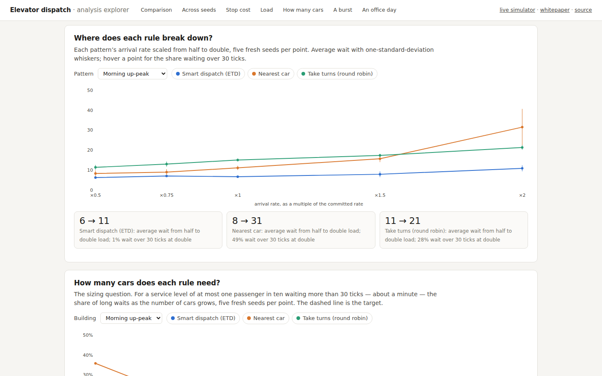

# elevator-dispatch-sim

[](https://github.com/samuelgregorovic/elevator-dispatch-sim/actions/workflows/ci.yml)

Discrete-time simulation of a destination-dispatch elevator system, built against the brief in [`docs/brief.pdf`](docs/brief.pdf): configurable cars, floors and capacity; three scheduling algorithms behind one interface; the positions log and passenger statistics the brief asks for; and a measured comparison of the schedulers on realistic traffic — one seed, twenty seeds, and five sensitivity studies.

## See it without installing anything

| [**Live simulator →**](https://samuelgregorovic.github.io/elevator-dispatch-sim/docs/viewer/) | [**Analysis explorer →**](https://samuelgregorovic.github.io/elevator-dispatch-sim/docs/results/) |
|---|---|
| The engine in your browser. Pick a traffic pattern and any building, watch all three rules on identical traffic with a live ranking, click a floor to add a passenger, set the stop cost, upload your own CSV. A JavaScript port of the Python engine, verified identical on every committed scenario. | Every result on one page. Pick a metric and the rules; see the committed comparison, the seed spreads, and the five studies — stop cost, load, how many cars, a burst, an office day — as interactive charts drawn from the committed JSON. |
| [](https://samuelgregorovic.github.io/elevator-dispatch-sim/docs/viewer/) | [](https://samuelgregorovic.github.io/elevator-dispatch-sim/docs/results/) |

Also readable on GitHub:

- **[The whitepaper](docs/WHITEPAPER.md)** — the whole story for a mixed audience: the question, the model, the rules, the evidence, and which rule and policy to choose for which building and traffic.
- **[The presentation](docs/presentation/elevator-dispatch.pdf)** — nineteen slides with speaker notes ([PowerPoint](docs/presentation/elevator-dispatch.pptx)).
- **[Results](docs/results/)** — [`comparison.md`](docs/results/comparison.md) (every scheduler on every scenario), [`robustness.md`](docs/results/robustness.md) (twenty fresh seeds per pattern), [`studies.md`](docs/results/studies.md) (stop cost, load, cars, bursts, the office day); discussed in [`docs/DESIGN.md`](docs/DESIGN.md#what-the-comparison-shows).
- **[Charts](docs/charts/)** and **[an example run](docs/example_run/)** — the exact files `run` produces for the morning up-peak.
- **[Source](src/elevator_sim/)** — start at [`simulation.py`](src/elevator_sim/simulation.py) for the tick loop, [`model.py`](src/elevator_sim/model.py) for car behaviour, [`schedulers/etd.py`](src/elevator_sim/schedulers/etd.py) for the cost function; [`tests/`](tests/) for what is guaranteed.

## Results in brief

- **Smart dispatch (ETD) has the lowest average and p90 wait on every realistic traffic pattern**, and the finding holds across twenty fresh seeds of every pattern (lowest in 119 of 120 runs on the six non-saturated patterns). Its margin over nearest-car is 1.2× on quiet traffic, 1.5–2× on office peaks and 2.6 ± 0.8× on a 51-floor tower (3.7× on the committed seed); 2–3× over round robin.
- **The margin grows with load.** On the morning peak, from half to double arrivals, ETD's average wait goes from 6 to 11 ticks, nearest-car's from 8 to 31 — and it holds when stops cost nothing (the brief's literal model), one tick or two.
- **It is a sizing question.** For at most one passenger in ten waiting over 30 ticks (about a minute), ETD needs 2 cars on the morning peak where the baselines need 5, and 9 on the tower where they need more than 10.
- **It recovers.** After a 30-person burst at one floor, ETD is back to normal in ~25 ticks; take turns ~40; nearest-car ~120.
- **Park by the clock or not at all.** Parking idle cars at the lobby cuts morning up-peak wait ~40% on every seed, but parked there all day it gives the gain back by evening; a schedule that follows the traffic (`--park-schedule`) cuts an office day's average wait by 11%.
- **ETD uses the least car travel per passenger** (6.1 floors against 9.3 and 10.0) because it bundles people going the same way — its riders sit through more intermediate stops, not fewer — and it shares the work least evenly (one car in four carries 36% of the passengers); the fairness weight narrows that gap in most seeds.
- **Two honest negatives.** Under a saturated lobby burst the three rules are within noise of each other; and zoning six cars into local and express at moderate load is a null result. A fairness weight of 0.5 reliably helps only under saturation.


## How to run

Requires Python 3.11+. The simulation itself has no third-party dependencies.

```bash
git clone https://github.com/samuelgregorovic/elevator-dispatch-sim.git
cd elevator-dispatch-sim

# with uv (recommended: also installs the dev tools)
uv sync --group dev
uv run python -m elevator_sim run scenarios/sample.csv --elevators 2 --floors 51 --capacity 8

# or with plain Python, no install
PYTHONPATH=src python3 -m elevator_sim run scenarios/sample.csv --elevators 2
```

`run` writes `positions.csv` (one row per tick, one column per elevator), `trace.json` (per-tick car state and every request/assign/board/alight event) and `summary.json` into `outputs/run/` (change with `--out`), and prints the passenger statistics:

```
scheduler: etd
passengers: 3   ticks simulated: 77

           min   max    mean    p50    p90
wait         0    45   15.00      0     45
travel      20    51   36.00     37     51
total       37    65   51.00     51     65

waited over 30 ticks: 1 (33%)   stops per trip: 0.00   floors per passenger: 40.7

car      carried  stops  floors   busy
1              1      2      50    66%
2              2      4      72    97%

observations:
  - median wait is 0 ticks: most passengers boarded immediately
  - 2 passengers boarded in the tick they requested (wait 0)
  - busiest origin floor: 1 (2 of 3 requests)
  - direction mix: 2 up, 1 down
  - elevator 1: carried 1, stops 2, floors travelled 50, busy 66% of ticks
  - elevator 2: carried 2, stops 4, floors travelled 72, busy 97% of ticks
  - 1 of 3 passengers (33%) waited more than 30 ticks
  - a delivered passenger sat through 0.0 intermediate stops on average and cost 40.7 floors of car travel
  - work balance: elevator 2 carried 67% of passengers (fair share 50%); busy share ranges over 31 points
```

Options for `run`: `--scheduler {etd,nearest_car,nearest_car_balanced,round_robin}` (default `etd`), `--fairness W` (ETD age weight, default 0), `--dwell N` (ticks per stop, default 1; `0` is the literal brief), `--start-floor`, `--park-floor` (send idle cars there), `--park-schedule 0:1,900:16` (park floor by time of day), `--express CAR:FLOORS` (e.g. `--express 3:1,30-51` makes car 3 serve only the lobby and floors 30–51).

Everything committed regenerates byte for byte:

```bash
uv run python -m elevator_sim compare --fairness 0.5 --out docs/results   # every scheduler × every scenario -> docs/results/comparison.{md,json}
uv run python scenarios/generate.py                      # the scenario CSVs (seeded)
uv run python scenarios/robustness.py                    # twenty fresh seeds per pattern -> docs/results/robustness.md (~2 min)
uv run python scenarios/studies.py                       # stop cost, load, cars, bursts, office day -> docs/results/studies.md + charts (~3 min)
uv sync --group dev --extra viz && uv run python -m elevator_sim report --fairness 0.05 --fairness 0.2 --fairness 0.5 --fairness 1   # the PNG charts
uv run pytest                                            # 225 tests (65 are the JS/Python conformance matrix; need Node)
uv run ruff check . && uv run ruff format --check .
```

## What was built

| | |
|---|---|
| **Engine** | Tick loop with a fixed order of operations; LOOK car movement; capacity; configurable dwell per stop; a request feed that structurally cannot peek ahead; input validation that fails fast with the row named. |
| **Schedulers** | `etd` — estimated-time-to-destination cost-based assignment as used by commercial destination-dispatch controllers, with an optional fairness weight; `nearest_car` (and a variant with balanced tie-breaks) and `round_robin` as baselines. |
| **Policies** | Park idle cars at a floor, or by a time-of-day schedule; zoned express cars. |
| **Scenarios** | Seeded generator for morning up-peak, lunchtime two-way, evening down-peak and interfloor traffic with the office mixes from the elevator-traffic literature; a capacity burst; two 51-floor cases; a whole office day; policy variants for parking and zoning. |
| **Analysis** | A comparison table; a twenty-seed robustness study; five sensitivity studies (stop cost, load, car count, a burst, the day); PNG charts; the interactive explorer. |
| **Outputs** | Positions log, JSON trace, statistics with p50/p90, the share of long waits, per-car usage and balance, efficiency per trip, generated observations; the browser simulator (JavaScript port of the engine, conformance-tested against Python). |
| **Tests** | 225 tests: unit tests for every observable assumption, a structural no-peek-ahead test, property-based invariants over random buildings, golden statistics for every committed result, end-to-end CLI checks, and a JavaScript/Python conformance matrix — plus adversarial testing: a 400-seed fuzz, malformed inputs, and twenty fresh seeds per pattern. |

## Assumptions, simplifications and trade-offs

Every decision the brief left open — what costs time, the order of operations inside a tick, immutable assignment, direction discipline, floor numbering, idle behaviour, validation, the service-level threshold, the seconds conversion — is recorded with its reason in [`docs/ASSUMPTIONS.md`](docs/ASSUMPTIONS.md). Design-level trade-offs (tick-based over event-driven, exact projection over a heuristic ETA, greedy per-request assignment, immutable assignment) are discussed in [`docs/DESIGN.md`](docs/DESIGN.md). The testing approach is in [`docs/TESTING.md`](docs/TESTING.md).

## Time and cost

Built with AI tooling, over two sessions on consecutive days: about two hours of my own time on the first, framing the problem and reviewing the plan and the first build; about four on the second, reviewing and steering the later work — the adversarial testing, the simulator, the documentation, the interface, the metrics, the presentation and the sensitivity studies. Six hours of my attention in all, plus three to four hours of unattended AI runs. AI usage cost under €100 in total (Fable 5.1 at medium effort for most of it, Opus 5 and Sonnet 5 on smaller tasks, the two design-tool runs for the interface and the deck included).

## What I would improve with more time

1. **Reassignment window.** Allow the controller to move a passenger to another car until their car starts slowing for the pickup, as hybrid ETA systems do. This is the single change most likely to improve results under bursty load, and it needs a display model (what the passenger was told) to stay honest.
2. **Batch re-optimisation.** Re-evaluate all outstanding assignments every few ticks instead of deciding each request once; the greedy per-request choice is what loses on the brief's three-request sample.
3. **Groups and no-shows.** Passengers travel alone in the generator; groups going to one floor would make demand lumpier and test the capacity-aware projection where it matters.
4. **The fairness weight by time of day.** The park floor now follows a schedule; the fairness weight could too, since it pays under saturation and costs elsewhere.
5. **Richer physics.** Door times and acceleration would make dwell a function of stop type; the one-tick model is enough to make stops cost something, and the ranking held at zero, one and two.
6. **Sky-lobby transfers.** Two-leg journeys across zones, so that zoned buildings can serve interfloor traffic; a routing problem across banks rather than a scheduler change.

## Repository

- `src/elevator_sim/` — the package (stdlib only); `schedulers/` holds the algorithms
- `tests/` — unit, structural, property-based, golden and CLI tests
- `scenarios/` — input files, `manifest.json`, the seeded generator, the seed and sensitivity studies
- `docs/` — brief, whitepaper, presentation, assumptions, design, research, testing, charts, results and the analysis explorer (`results/`), the browser simulator (`viewer/`)

MIT licence.
