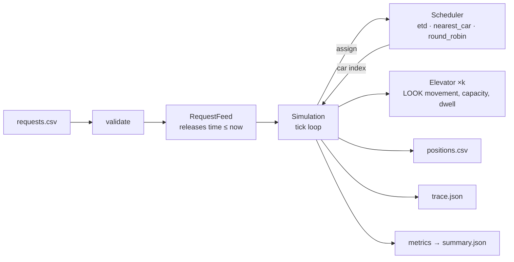
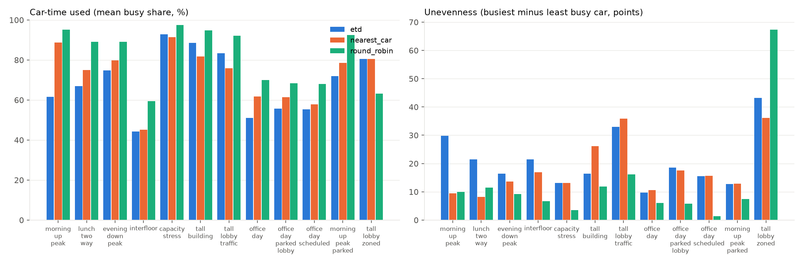
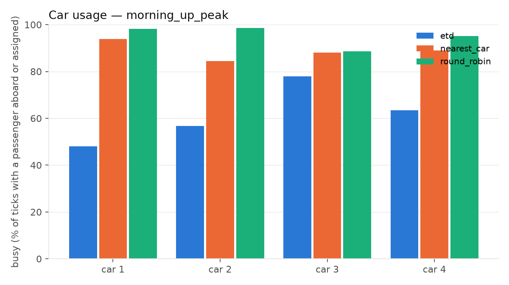
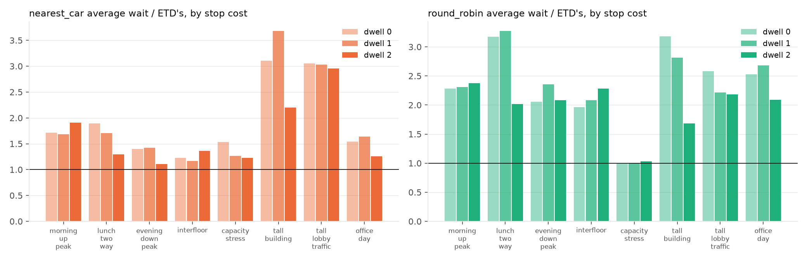
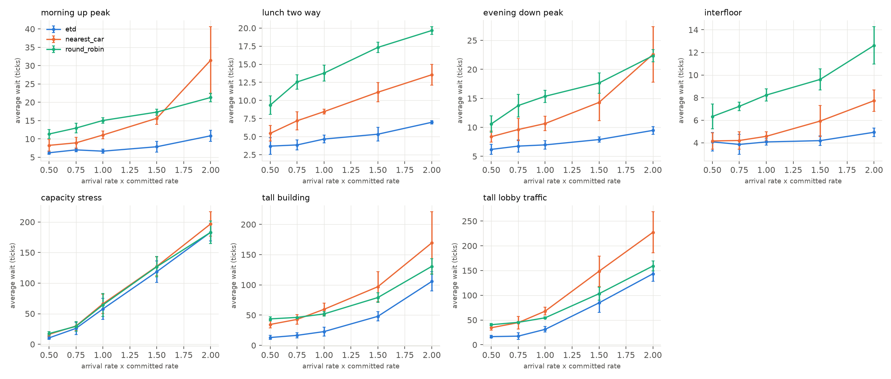
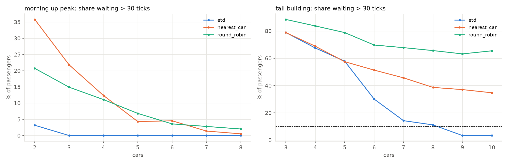
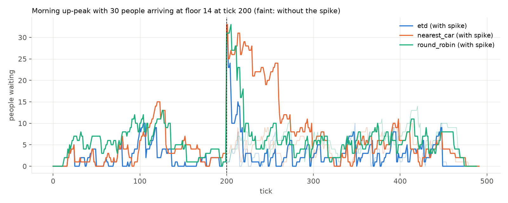
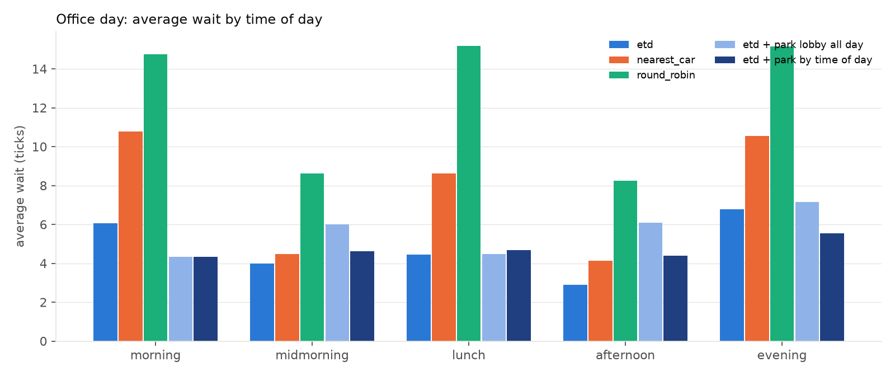

# Design

How the simulation is built, how the schedulers decide, and what the comparison shows. Assumptions are in [`ASSUMPTIONS.md`](ASSUMPTIONS.md) and are referenced here by number; the domain background is in [`RESEARCH.md`](RESEARCH.md).

## Architecture



Seven small modules, one responsibility each:

| module | responsibility |
|---|---|
| `model.py` | `Request`, `Passenger`, `Elevator`. The car's movement and boarding rules live here so the simulation and the ETD projection share one implementation. |
| `feed.py` | `RequestFeed`: the only source of requests; releases rows with `time <= now` (A16). |
| `simulation.py` | The tick loop in the fixed order of A3; produces positions, per-tick car states and events. |
| `schedulers/` | `Scheduler` protocol plus three implementations behind one interface. |
| `metrics.py` | Distributions (min, max, mean, p50, p90), per-car usage and balance (A20), and generated observations. |
| `validate.py`, `io.py` | Fail-fast input checks; CSV/JSON readers and writers. |
| `compare.py` | Runs a scheduler × scenario matrix from `scenarios/manifest.json`. |
| `docs/viewer/engine.js` | JavaScript port of the engine for the browser simulator; `tests/test_js_conformance.py` proves it identical to the Python engine on every scenario. |
| `docs/results/index.html` | The analysis explorer: one static page that renders `comparison.json`, `robustness.json` and `studies.json` as interactive charts and tables. |
| `scenarios/robustness.py`, `scenarios/studies.py` | The seed study and the five sensitivity studies; both write `docs/results/*.{md,json}` and the studies script draws its charts. |

The runtime is standard library only; `matplotlib` is an optional extra used only to render charts.

## The tick

A tick is the state at time `t`. Within a tick: release requests due at `t` → scheduler assigns each one → each car alights and boards at its current floor → positions logged → each car advances one step toward `t + 1` (dwell, move one floor, or stay). The consequences that matter: an idle car on the request floor gives wait 0; a car one floor away gives wait 1; a stop costs one extra tick by default (A2).

The loop ends when the feed is exhausted and every car is at rest. The simulation never jumps: if the next request is far in the future it ticks through the idle time, as the brief requires.

## Car behaviour

Each car runs LOOK (A12): keep the current direction while a stop lies ahead, otherwise reverse, otherwise idle. Stops are the destinations of passengers aboard plus the origins of passengers assigned but not yet picked up. A passenger boards only if the car will leave the floor in their direction, so no one is carried the wrong way; a full car keeps the pickup as a pending stop and returns (A8, A11). A stop is one dwell per floor visit: passengers who arrive while the car is already dwelling there may board if there is room, but they do not extend the dwell, so a busy lobby cannot hold a car indefinitely (A2).

One rule was added after a property-based test found a livelock: a passenger waiting at the car's *current* floor who wants to go in the car's current direction counts as a stop ahead. Without it, a single car facing two waiting passengers on adjacent floors with opposite directions reversed at each floor before either could board.

## Schedulers

All three implement `assign(request, cars, now) -> car index`, see only the current state of the cars, and must return a car that serves both floors (express cars, A10). Ties go to the lower car index (A13).

**Round robin.** Cars take requests in rotation. No use of position at all; a floor for the comparison.

**Nearest car.** Distance from the car to the origin, plus a large penalty if the car is moving away from the origin or in the wrong direction for the passenger. Ignores queued stops, which is the documented weakness of nearest-car control: a close car with many stops beats a slightly farther empty one.

**ETD (estimated time to destination).** The industry approach for destination dispatch (RESEARCH §1). For each feasible car the scheduler projects the car's route twice — as it is, and with the new passenger inserted — using the same LOOK and boarding code the simulation runs, so the projection is exact for that car if no further requests arrive. The cost is

```
cost(car) = (alight_new − now)                             # new passenger's time to destination
          + Σ_k  w_k · (alight_k' − alight_k)              # delay inflicted on each passenger k already
                                                           # assigned to the car (Peters' "system
                                                           # degradation factor")
w_k = 1 + fairness · (now − request_k)  if k is still waiting, else 1
```

and the lowest-cost car wins. Capacity enters through the projection: if the car would be full when it reaches the new passenger, the projection shows them boarding on a later pass and the cost rises accordingly. With `fairness = 0` the cost is pure system time; a positive weight makes delaying a passenger who has already waited a long time progressively more expensive, which is how commercial controllers keep the tail of the waiting-time distribution in check (RESEARCH §4).

The projection is O(route length) per candidate car and runs once per request, so a request costs O(cars × route). For the sizes in the brief (≤ 10 cars, hundreds of requests) a full comparison over all scenarios runs in a few seconds.

## What the comparison shows

`uv run python -m elevator_sim compare --fairness 0.5` on the committed scenarios (dwell 1, all cars start at the lobby; `etd_f0.5` is ETD with fairness weight 0.5; `nearest_car_balanced` is nearest-car with ties broken by occupancy instead of car index, see A13; the fairness-sweep charts use `--fairness 0.05 --fairness 0.2 --fairness 0.5 --fairness 1`). The sample from the brief is discussed separately below. **Every committed scenario is one seed.** The table fixes the direction of a finding, not its size; [`results/robustness.md`](results/robustness.md) re-runs every pattern with twenty fresh seeds and is the authority on which findings hold — the observations below say which.

| scenario | scheduler | n | ticks | wait avg | wait p90 | wait max | total avg | total p90 | total max | busy | spread | max car | wait >30 | stops/trip | floors/pax |
|---|---|---:|---:|---:|---:|---:|---:|---:|---:|---:|---:|---:|---:|---:|---:|
| sample | etd | 3 | 77 | 15.0 | 45 | 45 | 51.0 | 65 | 65 | 82% | 31% | 67% | 33% | 0.00 | 40.7 |
| sample | nearest_car | 3 | 54 | 6.3 | 19 | 19 | 42.7 | 52 | 52 | 84% | 24% | 67% | 0% | 0.33 | 29.3 |
| sample | nearest_car_balanced | 3 | 105 | 24.3 | 73 | 73 | 60.3 | 93 | 93 | 67% | 63% | 67% | 33% | 0.00 | 45.3 |
| sample | round_robin | 3 | 105 | 24.3 | 73 | 73 | 60.3 | 93 | 93 | 67% | 63% | 67% | 33% | 0.00 | 45.3 |
| sample | etd_f0.5 | 3 | 77 | 15.0 | 45 | 45 | 51.0 | 65 | 65 | 82% | 31% | 67% | 33% | 0.00 | 40.7 |
| morning_up_peak | etd | 166 | 474 | 7.1 | 16 | 19 | 20.6 | 33 | 44 | 62% | 30% | 36% | 0% | 1.76 | 6.1 |
| morning_up_peak | nearest_car | 166 | 487 | 12.0 | 34 | 68 | 24.7 | 49 | 73 | 89% | 9% | 27% | 17% | 1.21 | 9.3 |
| morning_up_peak | nearest_car_balanced | 166 | 490 | 11.0 | 32 | 41 | 23.5 | 41 | 61 | 92% | 3% | 30% | 11% | 1.11 | 9.7 |
| morning_up_peak | round_robin | 166 | 490 | 16.5 | 34 | 42 | 29.0 | 46 | 64 | 95% | 10% | 25% | 16% | 0.95 | 10.0 |
| morning_up_peak | etd_f0.5 | 166 | 482 | 7.7 | 16 | 22 | 20.6 | 31 | 39 | 68% | 18% | 31% | 0% | 1.39 | 6.9 |
| lunch_two_way | etd | 131 | 476 | 4.0 | 11 | 21 | 15.0 | 25 | 40 | 67% | 21% | 31% | 0% | 0.44 | 8.6 |
| lunch_two_way | nearest_car | 131 | 485 | 6.9 | 18 | 33 | 18.0 | 34 | 51 | 75% | 8% | 27% | 2% | 0.59 | 10.0 |
| lunch_two_way | nearest_car_balanced | 131 | 489 | 8.2 | 22 | 39 | 19.3 | 36 | 55 | 79% | 6% | 28% | 5% | 0.53 | 10.7 |
| lunch_two_way | round_robin | 131 | 487 | 13.2 | 28 | 38 | 24.2 | 40 | 55 | 89% | 11% | 25% | 8% | 0.40 | 11.9 |
| lunch_two_way | etd_f0.5 | 131 | 474 | 4.5 | 12 | 18 | 15.5 | 26 | 37 | 71% | 5% | 30% | 0% | 0.42 | 9.2 |
| evening_down_peak | etd | 113 | 341 | 7.6 | 17 | 25 | 19.3 | 36 | 44 | 75% | 16% | 27% | 0% | 0.70 | 8.0 |
| evening_down_peak | nearest_car | 113 | 331 | 10.8 | 33 | 43 | 23.1 | 48 | 69 | 80% | 14% | 29% | 12% | 1.30 | 8.3 |
| evening_down_peak | nearest_car_balanced | 113 | 331 | 10.8 | 31 | 43 | 23.2 | 42 | 69 | 82% | 10% | 30% | 11% | 1.43 | 8.6 |
| evening_down_peak | round_robin | 113 | 337 | 17.9 | 33 | 42 | 30.0 | 46 | 61 | 89% | 9% | 26% | 16% | 1.06 | 9.4 |
| evening_down_peak | etd_f0.5 | 113 | 337 | 8.6 | 17 | 27 | 20.3 | 35 | 45 | 80% | 10% | 28% | 0% | 0.67 | 8.5 |
| interfloor | etd | 85 | 457 | 3.9 | 10 | 17 | 11.4 | 19 | 29 | 44% | 21% | 29% | 0% | 0.26 | 8.3 |
| interfloor | nearest_car | 85 | 454 | 4.5 | 12 | 23 | 12.2 | 23 | 37 | 45% | 17% | 31% | 0% | 0.42 | 8.5 |
| interfloor | nearest_car_balanced | 85 | 454 | 4.5 | 12 | 23 | 12.2 | 23 | 37 | 45% | 17% | 31% | 0% | 0.42 | 8.5 |
| interfloor | round_robin | 85 | 462 | 8.1 | 15 | 27 | 15.5 | 25 | 47 | 60% | 7% | 26% | 0% | 0.15 | 11.6 |
| interfloor | etd_f0.5 | 85 | 457 | 3.6 | 8 | 17 | 11.1 | 19 | 29 | 45% | 21% | 29% | 0% | 0.26 | 8.4 |
| capacity_stress | etd | 76 | 290 | 60.3 | 91 | 120 | 73.0 | 108 | 140 | 93% | 13% | 50% | 80% | 1.99 | 6.0 |
| capacity_stress | nearest_car | 76 | 305 | 76.2 | 131 | 154 | 88.8 | 142 | 172 | 91% | 13% | 51% | 84% | 1.93 | 6.3 |
| capacity_stress | nearest_car_balanced | 76 | 303 | 73.6 | 124 | 136 | 86.1 | 131 | 153 | 93% | 11% | 54% | 84% | 1.78 | 6.4 |
| capacity_stress | round_robin | 76 | 281 | 60.1 | 98 | 128 | 72.8 | 110 | 135 | 98% | 4% | 50% | 78% | 1.91 | 6.2 |
| capacity_stress | etd_f0.5 | 76 | 269 | 55.2 | 83 | 99 | 67.7 | 96 | 119 | 93% | 9% | 51% | 78% | 1.79 | 5.6 |
| tall_building | etd | 231 | 371 | 18.3 | 37 | 108 | 47.2 | 78 | 124 | 88% | 16% | 18% | 16% | 3.16 | 7.5 |
| tall_building | nearest_car | 231 | 532 | 67.1 | 145 | 230 | 96.0 | 187 | 279 | 82% | 26% | 25% | 57% | 3.19 | 10.1 |
| tall_building | nearest_car_balanced | 231 | 498 | 47.9 | 116 | 220 | 77.0 | 150 | 253 | 80% | 38% | 24% | 43% | 3.38 | 9.2 |
| tall_building | round_robin | 231 | 431 | 51.4 | 95 | 115 | 80.2 | 131 | 164 | 95% | 12% | 17% | 70% | 3.02 | 9.5 |
| tall_building | etd_f0.5 | 231 | 381 | 22.9 | 45 | 56 | 51.5 | 78 | 105 | 92% | 10% | 19% | 31% | 2.83 | 8.1 |
| tall_lobby_traffic | etd | 198 | 367 | 21.4 | 37 | 56 | 51.6 | 78 | 96 | 83% | 33% | 24% | 24% | 2.98 | 8.3 |
| tall_lobby_traffic | nearest_car | 198 | 508 | 65.0 | 135 | 201 | 95.1 | 177 | 252 | 76% | 36% | 31% | 59% | 3.05 | 10.7 |
| tall_lobby_traffic | nearest_car_balanced | 198 | 458 | 50.3 | 110 | 208 | 80.2 | 150 | 250 | 87% | 22% | 25% | 50% | 2.77 | 11.1 |
| tall_lobby_traffic | round_robin | 198 | 422 | 47.5 | 90 | 121 | 77.2 | 127 | 157 | 92% | 16% | 17% | 67% | 2.57 | 10.7 |
| tall_lobby_traffic | etd_f0.5 | 198 | 366 | 23.0 | 40 | 53 | 52.7 | 74 | 93 | 93% | 10% | 20% | 32% | 2.64 | 9.3 |
| office_day | etd | 351 | 1519 | 5.1 | 13 | 25 | 16.1 | 28 | 46 | 51% | 10% | 26% | 0% | 0.82 | 7.8 |
| office_day | nearest_car | 351 | 1520 | 8.4 | 25 | 39 | 19.2 | 40 | 60 | 62% | 11% | 26% | 8% | 0.66 | 9.6 |
| office_day | nearest_car_balanced | 351 | 1515 | 8.6 | 26 | 39 | 19.4 | 40 | 60 | 63% | 13% | 29% | 7% | 0.68 | 9.7 |
| office_day | round_robin | 351 | 1536 | 13.8 | 30 | 41 | 24.6 | 43 | 62 | 70% | 6% | 25% | 10% | 0.58 | 11.0 |
| office_day | etd_f0.5 | 351 | 1518 | 5.2 | 13 | 31 | 15.9 | 27 | 50 | 53% | 10% | 29% | 0% | 0.62 | 8.2 |
| office_day_parked_lobby | etd | 351 | 1519 | 5.6 | 14 | 25 | 16.3 | 29 | 46 | 56% | 18% | 28% | 0% | 0.58 | 10.4 |
| office_day_parked_lobby | nearest_car | 351 | 1520 | 8.8 | 24 | 39 | 19.7 | 38 | 61 | 61% | 18% | 28% | 5% | 0.73 | 11.1 |
| office_day_parked_lobby | nearest_car_balanced | 351 | 1514 | 9.6 | 28 | 45 | 20.5 | 40 | 67 | 60% | 11% | 28% | 9% | 0.78 | 11.1 |
| office_day_parked_lobby | round_robin | 351 | 1536 | 13.8 | 31 | 40 | 24.6 | 43 | 55 | 68% | 6% | 25% | 10% | 0.58 | 12.2 |
| office_day_parked_lobby | etd_f0.5 | 351 | 1520 | 5.8 | 15 | 31 | 16.5 | 30 | 50 | 58% | 23% | 29% | 0% | 0.50 | 10.6 |
| office_day_scheduled | etd | 351 | 1536 | 5.1 | 11 | 29 | 15.7 | 27 | 48 | 55% | 15% | 27% | 0% | 0.51 | 10.8 |
| office_day_scheduled | nearest_car | 351 | 1549 | 8.5 | 26 | 47 | 19.4 | 38 | 62 | 58% | 16% | 29% | 7% | 0.73 | 11.2 |
| office_day_scheduled | nearest_car_balanced | 351 | 1531 | 8.6 | 26 | 41 | 19.5 | 37 | 63 | 60% | 7% | 28% | 8% | 0.73 | 11.3 |
| office_day_scheduled | round_robin | 351 | 1547 | 14.0 | 32 | 42 | 24.7 | 43 | 62 | 68% | 1% | 25% | 11% | 0.57 | 12.1 |
| office_day_scheduled | etd_f0.5 | 351 | 1534 | 5.3 | 13 | 29 | 15.9 | 26 | 50 | 56% | 20% | 29% | 0% | 0.45 | 10.7 |
| morning_up_peak_parked | etd | 166 | 484 | 4.3 | 11 | 22 | 16.8 | 28 | 43 | 72% | 13% | 27% | 0% | 1.16 | 9.6 |
| morning_up_peak_parked | nearest_car | 166 | 505 | 10.0 | 34 | 42 | 22.6 | 45 | 60 | 79% | 13% | 26% | 13% | 1.06 | 9.9 |
| morning_up_peak_parked | nearest_car_balanced | 166 | 514 | 9.4 | 36 | 44 | 21.8 | 46 | 63 | 76% | 10% | 27% | 14% | 1.00 | 9.9 |
| morning_up_peak_parked | round_robin | 166 | 507 | 16.3 | 33 | 40 | 28.9 | 46 | 62 | 92% | 7% | 25% | 14% | 0.87 | 10.3 |
| morning_up_peak_parked | etd_f0.5 | 166 | 482 | 5.5 | 14 | 23 | 17.9 | 29 | 39 | 76% | 4% | 27% | 0% | 0.87 | 9.8 |
| tall_lobby_zoned | etd | 198 | 394 | 25.8 | 59 | 79 | 55.2 | 98 | 133 | 80% | 43% | 21% | 37% | 2.30 | 8.6 |
| tall_lobby_zoned | nearest_car | 198 | 471 | 52.5 | 127 | 205 | 81.6 | 178 | 259 | 81% | 36% | 23% | 51% | 2.09 | 10.5 |
| tall_lobby_zoned | nearest_car_balanced | 198 | 471 | 52.6 | 127 | 205 | 81.8 | 178 | 259 | 78% | 38% | 23% | 51% | 2.16 | 10.1 |
| tall_lobby_zoned | round_robin | 198 | 549 | 56.3 | 144 | 248 | 85.6 | 180 | 299 | 63% | 67% | 30% | 59% | 2.20 | 9.5 |
| tall_lobby_zoned | etd_f0.5 | 198 | 416 | 27.8 | 65 | 93 | 56.6 | 103 | 128 | 80% | 37% | 21% | 38% | 1.80 | 9.1 |

Observations:

- ETD has the lowest average and p90 wait on every realistic pattern, and this is robust: across twenty fresh seeds it has the lowest average wait in 119 of 120 pattern × seed runs on the six non-saturated patterns (the exception is one interfloor seed); on the saturated burst it is lowest in 12 of 20, which is the subject of the next observation. The size of the margin varies with the seed: against nearest-car the committed seeds give 1.2× (quiet interfloor) to 3.7× (tall building), the twenty-seed means are 1.2× to 2.6 ± 0.8×, and the committed tall-building draw sits near the top of its range. Against round robin the factor is 2.1–3.0× across seeds. Nearest-car's naive tie-break (lowest car index, A13) is not the reason: with ties broken by occupancy instead (`nearest_car_balanced`) the committed tall-building ratio drops from 3.7× to 2.6×, but across seeds the two tie-breaks are within 0.2× of each other on every pattern. The margin is real; the headline number is one draw.
- On `capacity_stress` (two small cars, everyone at the lobby at once) the three rules are within noise of each other: 60.3 / 76.2 / 60.1 on the committed seed, 55 ± 20 / 61 ± 20 / 59 ± 19 across seeds, with ETD lowest in only 12 of 20. The scenario sits on a knife-edge — whether the Poisson draw saturates two cars of six decides the whole run — so the honest reading is that when the system is saturated the rule barely matters; the only lever is spreading load evenly, and any rule that does so lands in the same place.
- On the three-request sample from the brief nearest-car happens to beat ETD (6.3 vs 15.0 average wait). ETD spreads the two lobby passengers over both cars to avoid the extra stop, which leaves no idle car for the third request; nearest-car puts both on car 1 and the idle car 2 collects the third. Greedy assignment with no knowledge of future demand can lose on tiny inputs; the scenarios are what the algorithm should be judged on.
- Round robin's maximum wait is consistently *lower* than nearest-car's (tall building: 115 vs 230 committed; 142 ± 46 vs 252 ± 85 across seeds). Ignoring position is bad on average but it spreads load, which is the fairness-versus-efficiency tension the brief asks about. It does not beat ETD on the tail, though: on the committed tall-building seed round robin's 115 is close to ETD's 108, but across seeds ETD's maximum is 65 ± 13 against round robin's 142 ± 46 — the committed ETD draw is an outlier above its whole twenty-seed range.

### How the cars are used

The three right-hand columns of `results/comparison.md` (`busy`, `spread`, `max car`; definitions in A20) say how the cars were used rather than how the passengers fared.



- **ETD does the same job with the least car-time.** On the office patterns its cars are busy 62% of ticks in the morning peak against 89% for nearest-car and 95% for round robin; lunch 67% / 75% / 89%; interfloor 44% / 45% / 60%. It delivers everyone sooner *and* leaves the cars idle more. The mechanism is bundling, and the two efficiency columns of the table show both sides of it: ETD moves a morning-peak passenger with 6.1 floors of car travel against 9.3 for nearest-car and 10.0 for round robin (`floors/pax`), because it fills cars with people going the same way; the price is that its riders sit through *more* intermediate stops, 1.76 per trip against 1.21 and 0.95 (`stops/trip`) — the opposite of the "fewer stops" intuition, which turns out to describe the car, not the rider. Round robin's cars are the busiest everywhere (89–98% on the peaks), which is inefficiency, not throughput: they travel further to do the same work.
- **ETD spreads the work least evenly.** In the morning peak the busiest ETD car is busy 78% of ticks and the least 48% (spread 30 points), and it carries 36% of the passengers against a fair share of 25%. Round robin is even by construction (spread 7–12 points on the office patterns); nearest-car sits between (8–17). On the tall lobby traffic ETD runs two of six cars at 65–71% while two others run at 97–98%.
- **The fairness weight evens the cars, moderately reliably.** `etd_f0.5` cuts the spread from 30 to 18 points in the morning peak, 21 to 5 at lunch, 33 to 10 on the tall lobby traffic and 16 to 10 on the tower on the committed seeds; across twenty seeds it narrows the spread in 11–15 of 20 on every pattern (14 on the tower, 15 on the tall lobby traffic). Delaying a car's long-waiting passengers less means pulling in the cars that were sitting out. Parking has the same effect in the up-peak (30 to 13 points).
- **Zoning breaks round robin's evenness.** With three local and three express cars, rotation ignores which cars can serve a request, so one local car is busy 32% of ticks while an express car is at 99% (spread 67 points) — the largest imbalance in the table.



## Sensitivity: stop cost, load, cars, bursts, and a whole day

`uv run python scenarios/studies.py` ([`results/studies.md`](results/studies.md), about three minutes) asks the five questions the single comparison cannot. Five fresh seeds per point where the study says "across seeds"; the service level is the share of passengers waiting more than 30 ticks (A21).

**Stop cost.** The brief says nothing about stops; the model charges one tick (A2), and `--dwell 0` recovers the literal brief. Re-running every pattern at dwell 0, 1 and 2 shows the ranking does not depend on the choice: at dwell 0 ETD still wins every realistic pattern by similar margins (nearest-car 1.7× on the morning peak, 3.1× on the tower; round robin 2.3× and 3.2×), because what ETD accounts for is queued work, not stops. A stop cost of 2 narrows ETD's margin on the office patterns (lunch 1.3×, evening 1.1×) and widens it nowhere — consistent with the efficiency finding above: ETD's riders sit through more stops, so the dearer a stop, the more that costs. The expectation written before this study, that at dwell 0 the rules would converge, was wrong; the number is in the table and the sentence is corrected here. 

**Load.** Scaling each pattern's arrival rate from half to double, ETD's average wait rises slowly (morning peak 6.2 → 10.8 ticks) while nearest-car's rises steeply (8.3 → 31.4) and round robin's steadily (11.4 → 21.2); at double load nearest-car is worse than round robin on the morning peak, because its blindness to queued stops compounds. On the tower ETD holds 23 ticks at the committed rate where nearest-car is at 60, and at double load the three rules are at 106 / 170 / 131. On the saturated burst all three climb the same line: no rule beats arithmetic. 

**Cars.** Turning the question around — how many cars does each rule need so that at most one passenger in ten waits more than 30 ticks? On the morning peak ETD meets the target with **two** cars (3% over), nearest-car and round robin need **five**; on the 51-floor tower ETD needs nine and neither baseline gets there with ten. That is the sizing sentence: with a cost-based rule the same service level costs fewer shafts. 

**Bursts.** A normal morning peak with thirty people arriving at floor 14 at tick 200 (a meeting lets out). All three rules see the backlog jump to about 35 waiting; ETD is back to its no-spike backlog in 26 ± 8 ticks and the burst's own passengers wait 13 ticks on average; round robin recovers in 40 ± 16 (burst wait 17); nearest-car takes 123 ± 23 ticks to recover and the burst waits 57 — it keeps sending the nearest cars, which fill and leave, while the queue at floor 14 grows. 

**A whole office day.** `office_day` chains morning up-peak, a quiet mid-morning, lunch, a quiet afternoon and the evening down-peak in ten windows (1,500 ticks, 351 passengers). Over the day ETD averages 5.4 ticks against nearest-car's 9.0 and round robin's 13.9, and the ratio holds in every segment. Parking tells the honest story about time of day: parking at the lobby all day gives back the morning gain (6.1 → 4.3 in the morning segment) but costs it in the afternoon and evening (2.9 → 6.1, 6.8 → 7.2) and is neutral over the day (5.5 vs 5.4) while adding 30% more car travel; a schedule that follows the traffic — lobby in the morning and at lunch, mid-building when quiet, high in the evening (`park_schedule`, A22) — keeps the morning gain and adds an evening one (6.8 → 5.6), for 4.8 over the day, 11% below no parking, at the same extra travel. Parking is a time-of-day policy or it is not worth having. 

Two further charts from the committed traces: [backlog over time](charts/backlog_morning_up_peak.png) on the morning peak and the tower, and [who waits](charts/wait_by_floor_tall_building.png) — average wait by origin floor — which shows nearest-car's failure on the tower is at the lobby (82 ticks against ETD's 19), where it keeps loading whichever car is nearest.

The model behind all of this is checked against theory in [`results/theory.md`](results/theory.md): the engine reproduces the classical up-peak round-trip-time formula within 0.4% without the formula being in the code, and the formula's handling capacity predicts which patterns saturate — the lobby burst and the two 51-floor cases — which is the first-principles reason the rule barely matters there.

## Policies: fairness weight, parking, zoning

Three configuration-level policies were added after the baseline comparison. Each is one flag; the table above already includes them.

**Fairness weight.** With `fairness = 0.5` the delay inflicted on a passenger who has waited `a` ticks is weighted `1 + 0.5·a`. On the committed tall-building seed the maximum wait falls from 108 to 56 ticks while p90 *rises* from 37 to 45 and the average from 18.3 to 22.9 — and the seed study shows the maximum-wait half of that is not a policy effect: across twenty seeds the weight lowers the tower's maximum in 4 of 20 and raises its average in 18 of 20 (65 ± 13 → 74 ± 16 on the maximum). The committed ETD maximum of 108 is above the entire twenty-seed range, so "108 → 56" is an outlier being corrected. Under the capacity burst the effect is real: the maximum is lower in 14 of 20 seeds and the average higher in only 3 (committed: average 60.3 → 55.2, maximum 120 → 99). On the 20-floor office patterns it is small and mixed on every seed. The effect is not monotonic in the weight — see `docs/charts/fairness_sweep_*.png` — because the cost function is greedy and per-request: the weight changes which local choice wins, not the global structure. Read it as a tuning knob to be tried per building and traffic profile, with the measurement done on many seeds: at these loads it pays under saturation, and it does not reliably shorten the tail on a tall building. What it does do consistently is even out the cars (next section).

**Park idle cars at the lobby.** `morning_up_peak_parked` is the same traffic with `park_floor = 1`. ETD's average wait falls from 7.1 to 4.3 ticks (−39%; across twenty seeds −39 ± 12%, lower in 20 of 20) and p90 from 16 to 11; the maximum rises slightly (19 → 22) because a parked car is occasionally far from an upper-floor request. In up-peak nearly every request starts at the lobby, so an idle car waiting there answers it with wait 0. The cost is extra empty travel, and the same policy hurts in down-peak, where idle cars should wait high — the office-day study above measures both and shows that a schedule (`--park-schedule 0:1,300:10,600:1,900:10,1200:16`) is the version that pays across a day.

**Zoning / express cars.** `tall_lobby_zoned` splits six cars into three local (floors 1–26) and three express (lobby + 27–51), on lobby-only traffic. On the committed seed it is worse than the same six cars unzoned (ETD average wait 25.8 vs 21.4, maximum 79 vs 56); across twenty seeds it is a null result — zoned 24.4 ± 7.1 against free 24.8 ± 6.0, worse in 11 of 20. So at this load zoning neither helps nor hurts average wait measurably; the mechanism that would make it hurt (a request for floor 30 can only use three cars) and the one that would make it help (fewer stops per trip) roughly cancel. Zoning is a handling-capacity tool for saturated tall buildings and a way to save shaft space, not a wait-time optimisation at moderate load — consistent with the guidance in `RESEARCH.md` §5. Interfloor trips across the zone boundary are rejected before the run starts with a clear error; serving them needs a sky-lobby transfer, which is out of scope.

## Trade-offs made

- **Tick-based over event-driven.** The brief asks for a discrete-time model and the outputs are per-tick; an event queue would be faster for large idle gaps but adds complexity for no benefit at this scale.
- **Immutable assignment.** Matches real destination dispatch and the brief's wording; it also makes the scheduler's capacity awareness matter. Reassignment (as hybrid ETA systems allow until the car slows) would improve results under bursty load and is listed as future work.
- **Exact projection over a heuristic ETA.** Reusing the car's own movement code for projection is slower than an arithmetic estimate but cannot disagree with the simulation, which removes a whole class of subtle bugs.
- **Greedy, per-request assignment.** No look-ahead and no batch re-optimisation. This is what commercial controllers do at request time; it is also why ETD can lose on a tiny sample.
- **Generated observations over prose.** The brief asks for "notable observations"; producing them from the data for every run is more useful than writing a paragraph about one run.
