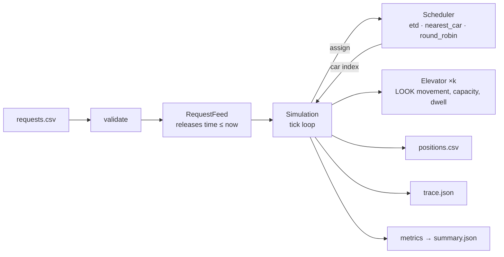

# Design

How the simulation is built, how the schedulers decide, and what the comparison shows. Assumptions are in [`ASSUMPTIONS.md`](ASSUMPTIONS.md) and are referenced here by number; the domain background is in [`RESEARCH.md`](RESEARCH.md).

## Architecture



Seven small modules, one responsibility each:

| module | responsibility |
|---|---|
| `model.py` | `Request`, `Passenger`, `Elevator`. The car's movement and boarding rules live here so the simulation and the ETD projection share one implementation. |
| `feed.py` | `RequestFeed`: the only source of requests; releases rows with `time <= now` (A16). |
| `simulation.py` | The tick loop in the fixed order of A3; produces positions, per-tick car states and events. |
| `schedulers/` | `Scheduler` protocol plus three implementations behind one interface. |
| `metrics.py` | Distributions (min, max, mean, p50, p90) and generated observations. |
| `validate.py`, `io.py` | Fail-fast input checks; CSV/JSON readers and writers. |
| `compare.py` | Runs a scheduler × scenario matrix from `scenarios/manifest.json`. |

The runtime is standard library only; `matplotlib` is an optional extra used only to render charts.

## The tick

A tick is the state at time `t`. Within a tick: release requests due at `t` → scheduler assigns each one → each car alights and boards at its current floor → positions logged → each car advances one step toward `t + 1` (dwell, move one floor, or stay). The consequences that matter: an idle car on the request floor gives wait 0; a car one floor away gives wait 1; a stop costs one extra tick by default (A2).

The loop ends when the feed is exhausted and every car is at rest. The simulation never jumps: if the next request is far in the future it ticks through the idle time, as the brief requires.

## Car behaviour

Each car runs LOOK (A12): keep the current direction while a stop lies ahead, otherwise reverse, otherwise idle. Stops are the destinations of passengers aboard plus the origins of passengers assigned but not yet picked up. A passenger boards only if the car will leave the floor in their direction, so no one is carried the wrong way; a full car keeps the pickup as a pending stop and returns (A8, A11).

One rule was added after a property-based test found a livelock: a passenger waiting at the car's *current* floor who wants to go in the car's current direction counts as a stop ahead. Without it, a single car facing two waiting passengers on adjacent floors with opposite directions reversed at each floor before either could board.

## Schedulers

All three implement `assign(request, cars, now) -> car index`, see only the current state of the cars, and must return a car that serves both floors (express cars, A10). Ties go to the lower car index (A13).

**Round robin.** Cars take requests in rotation. No use of position at all; a floor for the comparison.

**Nearest car.** Distance from the car to the origin, plus a large penalty if the car is moving away from the origin or in the wrong direction for the passenger. Ignores queued stops, which is the documented weakness of nearest-car control: a close car with many stops beats a slightly farther empty one.

**ETD (estimated time to destination).** The industry approach for destination dispatch (RESEARCH §1). For each feasible car the scheduler projects the car's route twice — as it is, and with the new passenger inserted — using the same LOOK and boarding code the simulation runs, so the projection is exact for that car if no further requests arrive. The cost is

```
cost(car) = (alight_new − now)                             # new passenger's time to destination
          + Σ_k  w_k · (alight_k' − alight_k)              # delay inflicted on each passenger k already
                                                           # assigned to the car (Peters' "system
                                                           # degradation factor")
w_k = 1 + fairness · (now − request_k)  if k is still waiting, else 1
```

and the lowest-cost car wins. Capacity enters through the projection: if the car would be full when it reaches the new passenger, the projection shows them boarding on a later pass and the cost rises accordingly. With `fairness = 0` the cost is pure system time; a positive weight makes delaying a passenger who has already waited a long time progressively more expensive, which is how commercial controllers keep the tail of the waiting-time distribution in check (RESEARCH §4).

The projection is O(route length) per candidate car and runs once per request, so a request costs O(cars × route). For the sizes in the brief (≤ 10 cars, hundreds of requests) a full comparison over all scenarios runs in about a second.

## What the comparison shows

`uv run python -m elevator_sim compare` on the committed scenarios (dwell 1, all cars start at the lobby):

| scenario | scheduler | n | ticks | wait avg | wait p90 | wait max | total avg | total p90 | total max |
|---|---|---:|---:|---:|---:|---:|---:|---:|---:|
| morning_up_peak | etd | 166 | 474 | 6.8 | 15 | 19 | 20.2 | 32 | 44 |
| morning_up_peak | nearest_car | 166 | 503 | 11.9 | 35 | 44 | 24.8 | 45 | 62 |
| morning_up_peak | round_robin | 166 | 494 | 16.6 | 34 | 42 | 29.4 | 47 | 64 |
| lunch_two_way | etd | 131 | 476 | 4.2 | 11 | 21 | 15.2 | 26 | 40 |
| lunch_two_way | nearest_car | 131 | 489 | 7.3 | 18 | 36 | 18.5 | 35 | 52 |
| lunch_two_way | round_robin | 131 | 487 | 13.2 | 28 | 38 | 24.2 | 40 | 55 |
| evening_down_peak | etd | 113 | 341 | 7.8 | 17 | 25 | 19.6 | 36 | 44 |
| evening_down_peak | nearest_car | 113 | 331 | 12.3 | 37 | 49 | 24.8 | 49 | 69 |
| evening_down_peak | round_robin | 113 | 337 | 17.9 | 33 | 42 | 30.0 | 46 | 61 |
| interfloor | etd | 85 | 457 | 3.9 | 10 | 17 | 11.4 | 19 | 29 |
| interfloor | nearest_car | 85 | 453 | 5.4 | 16 | 36 | 13.0 | 26 | 39 |
| interfloor | round_robin | 85 | 462 | 8.1 | 15 | 27 | 15.5 | 25 | 47 |
| capacity_stress | etd | 76 | 290 | 60.3 | 91 | 120 | 73.0 | 108 | 140 |
| capacity_stress | nearest_car | 76 | 340 | 82.1 | 153 | 178 | 94.8 | 171 | 196 |
| capacity_stress | round_robin | 76 | 281 | 60.1 | 98 | 128 | 72.8 | 110 | 135 |
| tall_building | etd | 231 | 362 | 17.9 | 38 | 108 | 47.0 | 73 | 124 |
| tall_building | nearest_car | 231 | 487 | 54.8 | 115 | 227 | 84.1 | 156 | 242 |
| tall_building | round_robin | 231 | 431 | 51.4 | 95 | 115 | 80.2 | 131 | 164 |

Observations:

- ETD has the lowest average and p90 wait on every realistic pattern, by a factor of roughly 1.5–3 over nearest-car. The gap is widest on the tall building, where nearest-car's blindness to queued stops hurts most.
- On `capacity_stress` (two small cars, everyone at the lobby at once) ETD and round robin are equal. When every request has the same origin and the system is saturated, the only lever is spreading load evenly, and round robin does that by construction. Nearest-car is worst here because it keeps piling passengers onto whichever car is nearest the lobby.
- On the three-request sample from the brief nearest-car happens to beat ETD (6.3 vs 15.0 average wait). ETD spreads the two lobby passengers over both cars to avoid the extra stop, which leaves no idle car for the third request; nearest-car puts both on car 1 and the idle car 2 collects the third. Greedy assignment with no knowledge of future demand can lose on tiny inputs; the scenarios are what the algorithm should be judged on.
- Round robin's maximum wait is often *lower* than nearest-car's (tall building: 115 vs 227). Ignoring position is bad on average but it never starves anyone, which is the fairness-versus-efficiency tension the brief asks about; the ETD fairness weight is the deliberate version of that trade.

## Trade-offs made

- **Tick-based over event-driven.** The brief asks for a discrete-time model and the outputs are per-tick; an event queue would be faster for large idle gaps but adds complexity for no benefit at this scale.
- **Immutable assignment.** Matches real destination dispatch and the brief's wording; it also makes the scheduler's capacity awareness matter. Reassignment (as hybrid ETA systems allow until the car slows) would improve results under bursty load and is listed as future work.
- **Exact projection over a heuristic ETA.** Reusing the car's own movement code for projection is slower than an arithmetic estimate but cannot disagree with the simulation, which removes a whole class of subtle bugs.
- **Greedy, per-request assignment.** No look-ahead and no batch re-optimisation. This is what commercial controllers do at request time; it is also why ETD can lose on a tiny sample.
- **Generated observations over prose.** The brief asks for "notable observations"; producing them from the data for every run is more useful than writing a paragraph about one run.
