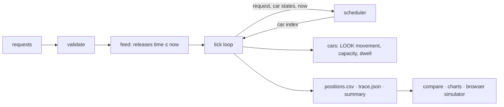
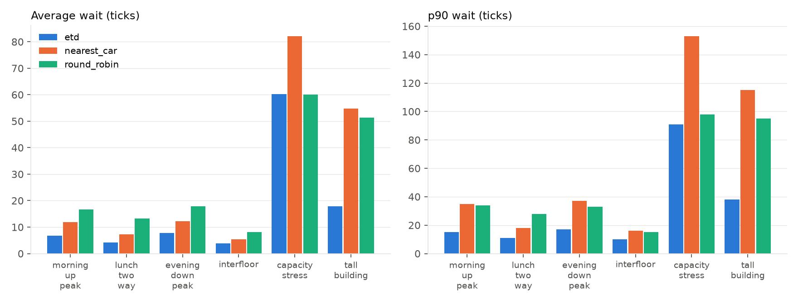
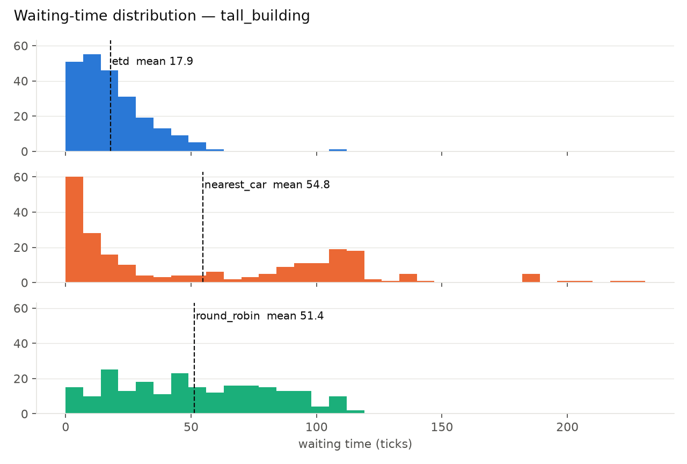

# Which car should you get? Dispatch rules for destination-controlled elevators, measured

*A top-to-bottom account of the elevator-dispatch-sim project: the question, the answer, the model, the evidence, and what to choose when. Every number below comes from [`results/comparison.md`](results/comparison.md) or a committed chart; every claim about real systems traces to [`RESEARCH.md`](RESEARCH.md).*

## The question, and the short answer

In a building with destination control, you tell the lift where you are going before you board and a controller decides which car you get. That decision is a rule, and the rule is a lever: on the same building with the same passengers, it changes how long people wait by a factor of two or three. This project built a simulation of that system, implemented three dispatch rules behind one interface, ran them on identical, realistic traffic, and measured the difference.

The answer: an estimated-time-to-destination rule — the approach commercial controllers use — gives the lowest average and 90th-percentile waits on every realistic traffic pattern tested, and the finding holds across twenty fresh re-draws of every pattern (lowest average wait in 119 of 120 runs on the six non-saturated patterns). The size of the margin depends on the draw: 1.2× better than "send the nearest car" on quiet interfloor traffic, 1.5–2× on office peaks, and 2.6× on average — 3.7× on the committed draw — on a 51-floor tower; 2–3× better than taking turns. Its advantage is smallest where traffic is light and largest where a building is tall and busy, and it grows with load: as arrivals double, smart dispatch's average wait on a morning peak rises from six to eleven ticks while nearest-car's rises from eight to thirty-one. In seconds — one tick is about two — that is a twenty-second wait against a minute. Put as a sizing question, smart dispatch meets a "no more than one in ten waits over a minute" service level with two cars on that morning peak where the other rules need five, and with nine cars on a 51-floor tower where they need more than ten. After a burst of thirty people at one floor it is back to normal in about 25 ticks; nearest-car takes 120. The ranking does not depend on the one modelling choice the brief left open — it holds when stops cost nothing, one tick or two. One operational policy matters almost as much as the rule, provided it follows the clock: parking idle cars at the lobby cuts morning up-peak wait by about 40% on every seed tried, but parked there all day it gives that back by evening; a schedule that moves the park floor with the traffic keeps the gain and adds an evening one, 11% less waiting over an office day. Two things do not survive re-drawing the traffic, and are reported as what they are: a fairness weight that halved the worst wait on the committed tower draw does not reliably shorten the tail across seeds (it does under saturation), and zoning six cars into local and express made no measurable difference to average wait at moderate load — neither the harm first reported nor the benefit intuition expects.

## The problem in plain language

A lift bank has a fixed number of cars, each with a capacity, serving a fixed number of floors. Passengers arrive over time, each with an origin and a destination. The controller must assign each passenger to one car at the moment they ask, and the assignment is final — the display tells them "car C" and they walk to it. Cars move one floor per unit of time, stop to load and unload, and follow the ordinary rule that a car keeps going in its direction while it has somewhere to go in that direction.

The brief that started the project asked for three things: everyone must be served eventually; the total time per passenger (waiting plus riding) should be minimised; and capacity and direction must be respected. It also asked for a positions log per tick, summary statistics, and — as optional extensions — several algorithms, express elevators, and an exploration of fairness against efficiency. All of that was delivered; this document is about what was learned.

Two things make the problem harder than it looks. First, the controller cannot see the future: it decides on each request with only the present state of the cars. Second, the objectives pull against each other. Minimising the *average* wait tends to bundle passengers onto the car that is already going their way, which is efficient in aggregate and occasionally cruel to the individual who keeps being passed over. A rule that is fair to everyone tends to waste car-kilometres. The interesting design space is between those poles.

## What was built

A Python package with no runtime dependencies simulates the building tick by tick. A request feed releases each passenger to the controller exactly at their request time and never earlier, so the "no peeking" constraint is a property of the structure rather than a promise. A scheduler interface receives one request at a time with the current state of the cars and returns a car index; three schedulers implement it. The simulation writes the positions log the brief asks for, a JSON trace of every event, passenger statistics (waiting, riding and total time), the share of long waits, per-car usage and balance, the efficiency of each delivered trip, and generated observations. Every committed result is also readable without opening a document: the [analysis explorer](https://samuelgregorovic.github.io/elevator-dispatch-sim/docs/results/) is one page that draws the comparison, the seed spreads and the five sensitivity studies from the committed JSON, with a metric and rule picker.

Around the engine sit the things that turn a simulator into evidence: a seeded generator for realistic traffic patterns with the directional mixes from the elevator-traffic literature; a `compare` command that runs every scheduler on every scenario and writes one table; chart generation; and a browser simulator on GitHub Pages that runs a JavaScript port of the engine — verified identical to the Python one on all 40 scenario × scheduler combinations by an automated test — so that a reader can watch three rules serve the same passengers side by side, add people to floors, or bring their own CSV, without installing anything.



## How the model works

Time is discrete. One tick is one floor of travel, as the brief specifies, and one further choice was made that the brief leaves open: a stop costs one tick. The literal brief is recovered with `--dwell 0`. The choice was expected to matter — without a stop cost, "fewer stops" can buy nothing — and the sensitivity study in the evidence section shows that it matters less than expected: the ranking and the margins hold at dwell 0, because what smart dispatch accounts for is queued work rather than stops.

Within a tick the order is fixed and documented: requests due now are released and assigned; each car unloads and then loads at its current floor, in request order, while capacity allows and only passengers who want to travel in the car's departure direction; positions are logged; then each car advances one step toward its next stop, or dwells, or stays idle. A consequence worth knowing when reading the numbers: a passenger who requests on the floor where an idle car stands boards in the same tick and has a wait of zero; a car one floor away arrives one tick later.

Cars follow LOOK: keep the current direction while a stop lies ahead in it, otherwise reverse, otherwise idle. Stops are the destinations of people aboard plus the origins of people assigned but not yet picked up. A car never carries anyone away from their destination, and a full car keeps the pickup as a pending stop and returns for it. Assignment is immutable, as in real destination-dispatch systems; that is what makes capacity the scheduler's problem rather than the car's.

Two rules were not in the first draft and were forced by tests. A property-based test found that a single car facing two waiting passengers on adjacent floors who want opposite directions could reverse at each floor before either boarded and oscillate forever; the fix counts a passenger waiting at the car's own floor who wants its current direction as a stop ahead. Adversarial testing found that every boarding restarted the dwell, so a busy lobby could hold a car indefinitely; now a stop is one dwell per floor visit and latecomers wait for the next pass. Both are documented in [`ASSUMPTIONS.md`](ASSUMPTIONS.md), with the tests that pin them.

## The dispatch rules

**Smart dispatch (ETD).** For each new request and each candidate car, the controller projects the car's route twice — as it is, and with the new passenger's pickup and drop-off inserted — using the same movement and boarding code the simulation runs, so the projection is exact for that car if nothing else changes. The cost of a car is the new passenger's projected time to destination plus the delay the insertion inflicts on every passenger already assigned to that car. The lowest cost wins. This is the estimated-time-to-destination method described by Peters Research and used in commercial destination-dispatch controllers; the "delay to others" term is their system degradation factor. Capacity enters through the projection: a car that would be full at the pickup shows the passenger boarding on a later pass, and the cost rises accordingly.

**Nearest car.** Distance from the car to the origin, with a large penalty if the car is moving away or in the wrong direction for the passenger. It ignores how many stops the car already has — the documented weakness of nearest-car control, and the reason it degrades under load. Ties (several idle cars at the same distance) go to the lowest car number; a `nearest_car_balanced` variant breaks them by occupancy instead, so that the comparison can show how much of the margin is the tie-break rather than the rule — little, across seeds.

**Take turns (round robin).** Cars take requests in strict rotation, wherever they are. It uses no information at all, which makes it the floor for the comparison and, by accident, the most even-handed rule: nobody is ever singled out for a long wait, everybody waits longer.

Three policies sit on top of the rules. A **fairness weight** multiplies the delay inflicted on a passenger who has already waited *a* ticks by `1 + w·a`, so long waits become progressively more expensive to extend; with `w = 0` the ETD rule is pure system time. **Parking** sends idle cars to a chosen floor instead of leaving them where they last stopped. **Zoning** restricts a car to a set of floors — the express-elevator extension the brief mentions — and the scheduler only considers cars that serve both ends of a trip.

## The evidence

### Method

Six traffic patterns were generated with a seeded generator and committed, one seed each, so every number is reproducible byte for byte; a second study ([`results/robustness.md`](results/robustness.md)) re-draws every pattern with twenty fresh seeds and is used below to say which findings are robust and which are one draw. The patterns: a morning up-peak (85% of trips up from the lobby, 10% down, 5% between floors), a lunchtime two-way peak (45/45/10), an evening down-peak, quiet interfloor traffic, a burst of lobby arrivals on two small cars, and a 51-floor tower. The office mixes are the ones the elevator-traffic literature uses for benchmarking (Barney & Al-Sharif; CIBSE Guide D via the sources in [`RESEARCH.md`](RESEARCH.md)); the burst and tower cases are stress tests chosen for the comparison and labelled as such. Two policy variants reuse the same traffic: the morning up-peak with idle cars parked at the lobby, and a lobby-only tall-building pattern run both unzoned and split into three local and three express cars. Every scheduler receives exactly the same request list; all cars start idle at the lobby; a stop costs one tick.

The metrics are the industry's: waiting time (request to boarding) and time to destination (request to alighting), reported as average, 90th percentile and maximum. The tail matters as much as the average, because a few very long waits are what people remember.

### Results

| scenario | rule | avg wait | p90 wait | max wait | avg total |
|---|---|---:|---:|---:|---:|
| Morning up-peak, 20 floors, 4 cars | Smart dispatch | **7.1** | **16** | **19** | **20.6** |
| | Nearest car | 12.0 | 34 | 68 | 24.7 |
| | Take turns | 16.5 | 34 | 42 | 29.0 |
| Lunch two-way, 20 floors, 4 cars | Smart dispatch | **4.0** | **11** | 21 | **15.0** |
| | Nearest car | 6.9 | 18 | 33 | 18.0 |
| | Take turns | 13.2 | 28 | 38 | 24.2 |
| Evening down-peak, 20 floors, 4 cars | Smart dispatch | **7.6** | **17** | **25** | **19.3** |
| | Nearest car | 10.8 | 33 | 43 | 23.1 |
| | Take turns | 17.9 | 33 | 42 | 30.0 |
| Quiet interfloor, 20 floors, 4 cars | Smart dispatch | **3.9** | **10** | **17** | **11.4** |
| | Nearest car | 4.5 | 12 | 23 | 12.2 |
| | Take turns | 8.1 | 15 | 27 | 15.5 |
| Lobby burst, 20 floors, 2 cars × 6 | Smart dispatch | 60.3 | **91** | **120** | 73.0 |
| | Nearest car | 76.2 | 131 | 154 | 88.8 |
| | Take turns | **60.1** | 98 | 128 | **72.8** |
| Tower, 51 floors, 6 cars | Smart dispatch | **18.3** | **37** | 108 | **47.2** |
| | Nearest car | 67.1 | 145 | 230 | 96.0 |
| | Take turns | 51.4 | 95 | 115 | 80.2 |
| Tower, with fairness weight 0.5 | Smart dispatch | 22.9 | 45 | **56** | 51.5 |
| Morning up-peak, idle cars parked at lobby | Smart dispatch | **4.3** | **11** | 22 | **16.8** |
| Tall lobby-only traffic, 6 free cars | Smart dispatch | **21.4** | **37** | **56** | **51.6** |
| Tall lobby-only traffic, 3 local + 3 express | Smart dispatch | 25.8 | 59 | 79 | 55.2 |

Ticks, throughout. Full table with p90/max total time and every variant in [`results/comparison.md`](results/comparison.md); distributions and sweeps in [`charts/`](charts/).



Four observations carry the analysis that follows. Smart dispatch wins every realistic pattern on average and on the 90th percentile, and the margin grows with load and height: 1.15× over nearest-car on quiet interfloor traffic, 1.4–1.7× on the office peaks, 3.7× on the tower on the committed draws; across twenty fresh seeds the tower margin is 2.6 ± 0.8× and smart dispatch is lowest in 119 of 120 runs on the six non-saturated patterns, so the direction is certain and the tower headline is a high draw. Nearest-car's naive tie-break (ties go to car 1) is not what the margin measures: breaking ties by occupancy instead brings the committed tower ratio to 2.6× but changes the twenty-seed means by less than 0.2× on any pattern. Under the lobby burst, where every request has the same origin and the system is saturated, the three rules are within noise of each other — the run is decided by whether the arrival draw saturates two small cars, and once it does, no rule has a lever left except spreading load. On the tower, take-turns' maximum wait looks close to smart dispatch's on the committed draw (115 against 108); across seeds it is not (142 ± 46 against 65 ± 13 — the committed smart-dispatch maximum is an outlier), though take-turns does beat nearest-car's tail everywhere, because ignoring position never lets one car absorb a burst. And on the brief's own three-request sample, nearest-car beats smart dispatch (6.3 against 15.0 average wait): smart dispatch spreads two lobby passengers across both cars to save a stop, leaving no idle car for the third request; a greedy rule with no view of the future can lose on tiny inputs, which is why the scenarios, not the sample, are the basis for judgement.



Waiting time says how the passengers fared. A second set of numbers, added after the first analysis, says how the cars were used: for each car, the share of the run it was busy — carrying someone or on its way to someone assigned to it — and, across cars, the average (how much car-time the rule spends) and the spread between the busiest and the least busy car (how evenly the work is shared). Two findings follow. Smart dispatch does the same job with the least car-time — its cars are busy 62% of the morning peak against 89% for nearest-car and 95% for take-turns, and the pattern holds on every office scenario — because it bundles: it fills cars with people going the same way, so each passenger costs 6.1 floors of car travel against 9.3 and 10.0 — and, the other side of bundling, its riders sit through *more* intermediate stops, 1.76 a trip against 1.21 and 0.95, so "fewer stops" describes the car, not the rider; take-turns keeps its cars the busiest everywhere, which is waste, not throughput. But smart dispatch also shares the work least evenly: in the morning peak its busiest car is busy 78% of the time and its least 48%, and one car carries 36% of the passengers where a fair share is 25%; take-turns is even by construction (a spread of 7–12 points on the office patterns). The fairness weight closes most of that gap as a side effect — 30 to 18 points in the morning peak, 21 to 5 at lunch, 33 to 10 on the tall lobby traffic — because favouring long-waiting passengers pulls in the cars that were sitting out.


### Beyond the single comparison

Five further studies ([`results/studies.md`](results/studies.md), regenerated by one command) answer the questions a fixed comparison cannot, each with fresh seeds where it says so.

*Does the stop cost decide the result?* No. Re-running every pattern with stops costing nothing (the brief's literal model), one tick or two, smart dispatch wins every realistic pattern at every setting, by similar margins at zero and one; a two-tick stop narrows its lead on the office patterns because its bundled riders sit through more stops. The expectation, written before the study, that the rules would converge at zero was wrong, and the table says so.

*Where does each rule break down?* Scaling arrivals from half to double the committed rate, smart dispatch degrades gently and the baselines steeply: on the morning peak 6 → 11 ticks against 8 → 31 for nearest-car, whose blindness to queued stops compounds with load until, at double load, it is worse than taking turns. On the saturated burst all three climb the same line — no rule beats arithmetic. 

*How many cars?* For a service level of at most one passenger in ten waiting more than 30 ticks — about a minute — smart dispatch needs two cars on the morning peak where nearest-car and take-turns need five, and nine on the 51-floor tower where neither baseline gets there with ten. Shafts are the expensive part of a lift bank; the rule is the cheap part. 

*What happens after a burst?* Thirty people arriving at one floor in the middle of a normal morning: smart dispatch clears the backlog in 26 ± 8 ticks and the burst waits 13 on average; take-turns 40 ± 16 and 17; nearest-car 123 ± 23 and 57, because it keeps sending the closest cars, which fill and leave while the queue grows. 

*And across a whole day?* Chaining morning, quiet, lunch, quiet and evening into one 1,500-tick run, smart dispatch averages 5.4 ticks against 9.0 and 13.9, in every segment. Parking is the lesson: at the lobby all day it wins the morning and loses the afternoon and evening, neutral overall at 30% more car travel; a schedule that follows the traffic keeps the morning gain and adds an evening one, 4.8 over the day against 5.4. 

Two more views come from the committed traces: [backlog over time](charts/backlog_tall_building.png), and [who waits](charts/wait_by_floor_tall_building.png) — average wait by origin floor — which shows that nearest-car's failure on the tower is at the lobby (82 ticks against 19), where it keeps loading whichever car is nearest.

## Which rule, which policy, for which building

This section is the practical output. The recommendations are only as strong as the scenarios behind them — six patterns, two building sizes, one traffic level per pattern — and each row says how much of the data supports it.

**Ordinary office, moderate traffic (up to about 20 floors, 4 cars).** Use smart dispatch. It wins all four office patterns on average wait — by 30–42% over nearest-car on the three peaks and 13% on quiet traffic — and halves the 90th percentile in the morning and evening peaks. The absolute numbers are small — an average wait of four to eight ticks, ten to fifteen seconds — so at today's load the business case is comfort and predictability; but the load curve says the gap widens as the building fills, and the car sweep says the same service level costs two cars instead of five. Evidence: strong; four patterns, consistent direction, five load levels.

**Quiet buildings and interfloor traffic.** Smart dispatch still wins, but by 13% on average and 17% on the 90th percentile. If the controller in place is nearest-car, the gain from replacing it is real but small; the money is better spent where load is high. Evidence: one pattern.

**Tall buildings (around 50 floors).** This is where the rule matters most. Nearest-car's blindness to queued stops costs 3.7× on average wait and a maximum wait of 230 ticks against smart dispatch's 108; take-turns is 2.8× worse on average. Any building this tall should run a cost-based rule. Evidence: strong on direction, one building.

**Where the tail matters — hospitals, hotels, anywhere a 100-tick wait is a complaint.** The fairness weight is the lever built for this, and the honest finding is that at these loads it only reliably works under saturation. On the committed tower draw `w = 0.5` cut the maximum wait from 108 to 56, but it raised the 90th percentile from 37 to 45 and the average from 18.3 to 22.9, and across twenty fresh draws it lowered the tower's maximum in only 4 of 20 while raising the average in 18 of 20: the committed 108 was an outlier above the whole twenty-seed range, and the weight was correcting a bad draw, not the tail. Under the lobby burst the effect is real — maximum lower in 14 of 20 seeds, average higher in only 3. On the 20-floor office patterns its effect is small and mixed on every seed. The weight is not monotonic: the greedy rule chooses a different local optimum as the weight changes, and the sweep charts show the curve folding back on itself. Treat it as a setting to be tried per building and measured on many draws of that building's traffic, and expect it to pay under saturation rather than on an under-loaded tall bank. Evidence: robust on the burst; not reproduced on the tower; weak on the office patterns.

**A bank being sized, or a building growing into its shafts.** Decide the rule before the car count. For "at most one in ten waits over a minute", smart dispatch needs two cars on the morning peak where the baselines need five, and nine on the tower where the baselines need more than ten; and at double today's arrivals smart dispatch's wait is still under a third of nearest-car's. Evidence: five seeds per point, two buildings.

**Buildings with bursts — meeting floors, lecture theatres, event spaces.** Smart dispatch recovers from a thirty-person burst in about 25 ticks; nearest-car takes about 120 and makes the burst wait a minute. The fairness weight is not the lever here; the rule is. Evidence: one burst shape, five seeds.

**Morning up-peak with a known lobby.** Park idle cars at the lobby. Average wait fell from 7.1 to 4.3 ticks and the 90th percentile from 16 to 11 on the same traffic, because in up-peak nearly every request begins at the lobby and an idle car waiting there answers it with a wait of zero. The maximum rose slightly (19 to 22): a parked car is occasionally far from an upper-floor request. The same policy hurts in the evening, when idle cars should wait high — measured across a whole office day, lobby parking all day is neutral (5.5 against 5.4) at 30% more car travel, while a schedule that moves the park floor with the traffic gives 4.8, 11% less waiting. Park by the clock or not at all. Evidence: one morning pattern across twenty seeds; the day across five.

**Saturation — more people than the cars can move.** No rule fixes a capacity problem. Under the lobby burst all three rules leave people standing for a minute or more, and across seeds they are within noise of each other (smart dispatch lowest in 12 of 20). The levers here are cars, capacity and, in a tall building, zoning — but see the next row before reaching for it. Evidence: one pattern, twenty seeds, same answer on every seed: the rule does not matter here.

**Zoning and express cars.** Do not zone to reduce waits at moderate load — but not because it hurts: it makes no measurable difference. Splitting six cars into three local (floors 1–26) and three express (lobby and 27–51) on lobby-only tower traffic raised the average wait from 21.4 to 25.8 on the committed draw, and across twenty fresh draws the zoned bank is 24.4 ± 7.1 against 24.8 ± 6.0 unzoned, worse in 11 of 20. The two mechanisms — a request for floor 30 can use only three cars; each car makes fewer stops per trip — cancel at this load. Zoning is what the literature says it is: a handling-capacity and shaft-space measure for saturated tall buildings, where cutting stops per trip is worth the lost flexibility. The one saturated case in this study is a 20-floor building with two cars, where zoning is not meaningful, so the point at which zoning starts to pay was not measured; it is the first experiment to run if a real zoned building is on the table. Interfloor trips across a zone boundary are rejected outright here, because serving them needs a sky-lobby transfer, which the model does not have. Evidence: a null result at moderate load, twenty seeds; the positive case untested.

**Where even wear across cars matters — maintenance contracts priced per car, or a bank where one car must not age faster than the rest.** Smart dispatch on its own concentrates work: one car in four does 36% of the morning-peak passengers, and on the tall lobby traffic two cars of six sit at two-thirds the utilisation of the others. Do not switch to take-turns to fix this — it evens the cars by making all of them work more, and passengers wait two to three times longer. The fairness weight evens the cars as a side effect: at `w = 0.5` the spread between busiest and least busy car falls to 5–18 points on the office patterns and 10 on the towers on the committed draws, and across twenty fresh draws it narrows the spread in 11–15 of 20 on every pattern, at the cost in average wait described above. Where the weight is unwelcome, rotating which car is preferred when costs tie is the next lever to build. Evidence: direction consistent on the committed scenarios and in a majority of seeds, not all; the size of the "wear" benefit is not modelled — this study counts ticks, not maintenance.

**When the simple rule is enough.** With one car there is no dispatch decision and all rules coincide — the browser simulator reports a tie, honestly. With very light traffic on a small building, nearest-car is within 15% of smart dispatch. Everywhere else the cost-based rule earns its complexity, and its complexity is modest: the projection reuses the car's own movement code, and a full comparison over all scenarios runs in a few seconds.

## Limits, and what would change the conclusions

The model omits door and acceleration physics (a stop is one tick regardless of how many people board), reassignment after dispatch (hybrid systems can move a passenger until the car begins slowing, which would help under bursty load), sky-lobby transfers, passenger no-shows and group entries, and energy. Arrival rate and car count were swept on five seeds per point; the fairness weight was swept on two scenarios only; the burst study uses one burst shape. Seed variance was measured after the first analysis and changed two secondary conclusions (fairness on the tower; zoning) — the argument for having measured it. Passengers travel alone; groups would make demand lumpier and are the next thing to add to the generator. The zoning experiment lacks its saturated counterpart. The assignment is greedy and per-request; a batch re-optimisation every few ticks is the improvement most likely to change the numbers, and it is first on the list of future work in the README.

None of these would reverse the headline: a rule that accounts for queued stops and the delay it inflicts on others beats rules that do not, increasingly so as buildings get taller and busier — that much survived twenty re-draws of every pattern. They would sharpen the secondary findings — where parking, fairness and zoning start and stop paying.

## How the numbers were assured

The engine is covered by 228 tests at six levels: unit tests for every observable assumption; a structural test that the scheduler never sees a future request; property-based invariants over random buildings, cars, capacities, express zones and parking (every passenger delivered, one floor per tick, capacity never exceeded, boarding only at origin and alighting only at destination, deterministic re-runs); golden statistics — the brief's sample, every row of the committed comparison table, and the empirical findings that also held across seeds; and a conformance matrix that runs the JavaScript port with Node on all 65 scenario × scheduler combinations and asserts positions, events, passenger lifecycles and per-car usage identical to Python. The scenario generator is re-run inside the suite and compared byte for byte with the committed files.

Separately, the finished system was reviewed end to end — requirements against the brief, research sourcing, code, tests, the browser page and the documents — with a 400-seed fuzz, malformed and adversarial inputs, and a re-run of every pattern with twenty fresh seeds. The model itself was checked against theory: with one car and a lobby full of passengers, the engine's round-trip time matches the classical Barney & Al-Sharif formula within 0.4% on six building sizes, and the formula's handling capacity predicts exactly which committed patterns saturate ([`results/theory.md`](results/theory.md)). The dwell-restart correction above, the double-rounding of the published means, the research sentences that outran their sources, and the distinction this document draws between findings that held across seeds and findings that were one draw all came from that review.

## How the work was done

One engineer, AI tooling, two days. The plan came first, with every ambiguity in the brief resolved in writing before code; the engine, tests, scenarios and comparison followed in that order; then a round of adversarial testing, the browser simulator, this document, the interface, the car-usage metrics, the presentation and the sensitivity studies. Time and cost are stated in the README.

## Reproducing every number

```bash
git clone https://github.com/samuelgregorovic/elevator-dispatch-sim.git && cd elevator-dispatch-sim
uv sync --group dev
uv run python -m elevator_sim compare --fairness 0.5          # the table above
uv run python scenarios/robustness.py                            # twenty fresh seeds per pattern (about two minutes)
uv run python scenarios/studies.py                               # stop cost, load, cars, bursts, the day (about three minutes)
uv run python scenarios/theory.py                                # the engine against elevator-traffic theory (about ten minutes)
uv sync --extra viz && uv run python -m elevator_sim report --fairness 0.05 --fairness 0.2 --fairness 0.5 --fairness 1   # the charts
uv run python scenarios/generate.py                              # the scenario files, byte-identical
uv run pytest                                                    # 228 tests
```

Or open the [browser simulator](https://samuelgregorovic.github.io/elevator-dispatch-sim/docs/viewer/) and set any building and traffic pattern; it runs the same rules, verified identical to the Python engine.

## Glossary

*Destination dispatch / destination control* — passengers enter their destination before boarding and are assigned a car. *ETD* — estimated time to destination, the cost-based assignment rule. *LOOK* — the car-level rule of continuing in the current direction while stops remain ahead. *Tick* — one unit of simulated time, equal to one floor of travel. *Dwell* — the tick a car spends stopped to load or unload. *Up-peak / down-peak / two-way* — the standard office traffic patterns: arrivals from the lobby in the morning, departures to it in the evening, both at lunch. *Busy share* — the fraction of the run in which a car had a passenger aboard or assigned to it; the *spread* is the busiest car's share minus the least busy car's, in points. *Service level* — the share of passengers who waited more than 30 ticks, about a minute. *Stops per trip* — intermediate stops a passenger sat through between boarding and alighting. *p90* — the value below which 90% of passengers fall. *Handling capacity* — passengers a lift group can move in five minutes.
